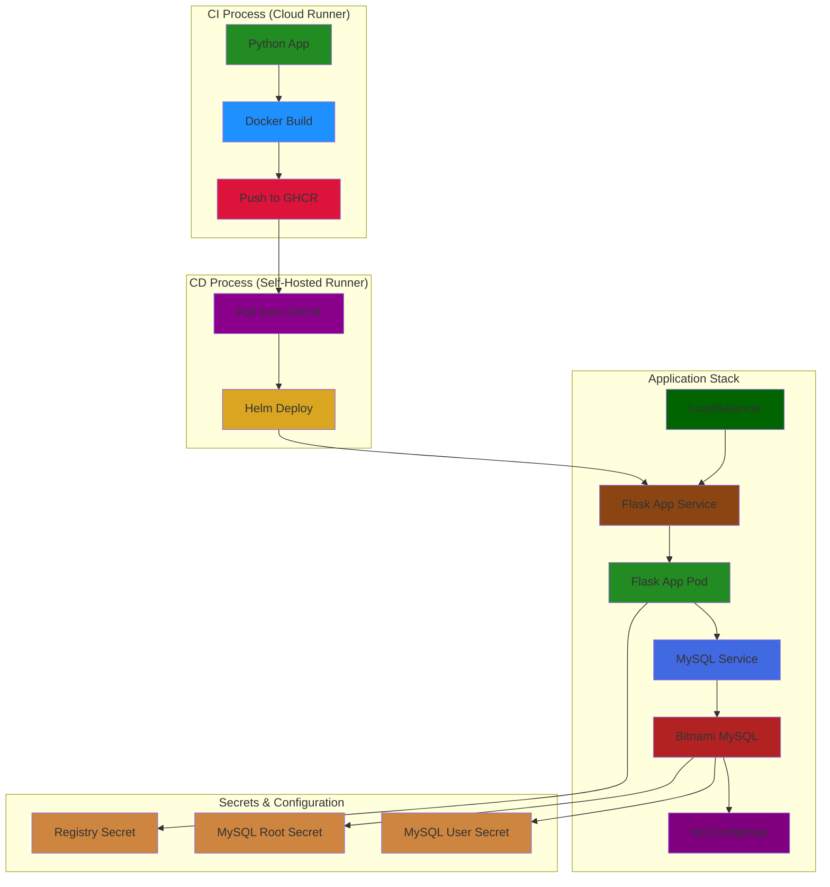

# Python Application with CI/CD Pipeline and Bitnami MySQL Integration

## Project Overview
This project implements a CI/CD pipeline using GitHub Actions (CI) and a self-hosted runner (CD), deploying a Python Flask application with Bitnami MySQL integration. The pipeline automates building, testing, containerization, and deployment processes.

## Architecture

### System Flow


## Key Features

### Bitnami MySQL Integration
- Simplified deployment using Helm chart
- Reduced YAML configuration (from 400+ lines to ~10 lines)
- Built-in monitoring, backup, and security features

### CI/CD Pipeline
- **CI**: Automated builds, tests, and Docker image publishing
- **CD**: Self-hosted runner for controlled deployments
- Secure credentials management

## Prerequisites
- GitHub account and repository access
- Docker
- Kubernetes cluster
- Helm 3.x
- Self-hosted runner
- GHCR access

## Quick Start

### 1. Setup Repository
```bash
git clone <repository-url>
cd <repository-name>
# Add GITHUB_TOKEN and PAT_GHCR secrets in GitHub
```

### 2. Configure Database
```bash
# Create secrets
kubectl create secret generic mysql-credentials \
  --from-literal=root-password=<root-password> \
  --from-literal=user-password=<user-password> \
  -n dvir-app

# Deploy with Helm
helm dependency update ./my-chart
helm upgrade -i my-app-dev ./my-chart \
  --namespace dvir-app \
  --set mysql.auth.rootPassword="${MYSQL_ROOT_PASSWORD}"
```

### 3. Verify Deployment
```bash
kubectl get pods,svc -n dvir-app
```

## Troubleshooting Guide

### Quick Checks
```bash
# CI Issues
- Check GitHub Actions logs
- Verify Docker build locally

# CD Issues
- Check runner status: gh runner list
- Verify Helm: helm list -n dvir-app

# Application Issues
kubectl logs -f <pod-name> -n dvir-app
kubectl get all -n dvir-app

# Database Issues
kubectl logs -f <mysql-pod> -n dvir-app
kubectl exec -it <mysql-pod> -n dvir-app -- \
  mysql -u root -p<password> -e "SHOW DATABASES;"
```

## Security Notes
- Development: Root access enabled for simplicity
- Production: Use restricted users and enable SSL/TLS

## Contributing
1. Fork repository
2. Create feature branch
3. Submit pull request

---


