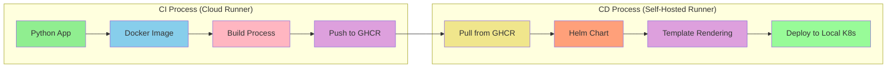

# Python Application with Local Kubernetes Deployment

## Project Overview
Extended CI/CD pipeline that builds a Python application, pushes to GHCR, and deploys to a local Kubernetes cluster using Helm charts with a self-hosted GitHub Actions runner.

## Architecture Flow


## Project Structure
```
project-root/
├── .github/
│   └── workflows/
│       └── ci.yml          # CI/CD pipeline configuration
├── my-chart/              # Helm chart directory
│   ├── Chart.yaml
│   ├── values.yaml
│   └── templates/
│       ├── deployment.yaml
│       ├── service.yaml
│       └── _helpers.tpl
├── app.py                 # Python application
├── Dockerfile            # Container definition
└── README.md
```

## CI/CD Pipeline Stages

### 1. Build Stage (Cloud Runner)
- Checkout code
- Setup Python environment
- Build Docker image
- Push to GHCR
- Create GitHub Release

### 2. Deployment Stage (Self-Hosted Runner)
- Pull image from GHCR
- Configure Helm
- Update chart values
- Deploy to local Kubernetes cluster
- Verify deployment

## Local Environment Setup

### Prerequisites
- Kubernetes cluster (Minikube/Kind)
- Helm
- GitHub Actions self-hosted runner
- Docker
- PowerShell

### Self-Hosted Runner Setup
1. Add runner to GitHub repository
2. Configure runner on local machine
3. Ensure runner has access to:
   - kubectl
   - helm
   - docker
   - PowerShell

## Helm Deployment

### Chart Configuration
```yaml
# values.yaml defaults
image:
  repository: ghcr.io/username/image
  tag: latest
replicaCount: 2
nameOverride: world-of-games
namespace: dvir-app
```

### Deployment Commands
```powershell
# Template rendering
helm template my-app ./my-chart --debug \
  --set image.repository=$imageRepository \
  --set image.tag=$imageTag

# Installation/Upgrade
helm upgrade -i my-app ./my-chart --debug \
  --set image.repository=$imageRepository \
  --set image.tag=$imageTag
```

## Required Secrets
- `GITHUB_TOKEN`: For GHCR access
- `PAT_GHCR`: Personal Access Token

## Verification
```bash
# Check deployment status
kubectl get pods -n dvir-app
kubectl get services -n dvir-app
```

## Troubleshooting

### Common Issues
1. **Self-Hosted Runner Connection**
   - Verify runner is online
   - Check runner permissions
   - Ensure required tools are installed

2. **Helm Deployment**
   - Validate chart syntax
   - Check namespace exists
   - Verify image pull credentials

3. **Kubernetes Deployment**
   - Check pod status
   - View pod logs
   - Verify service configuration

## Monitoring
- GitHub Actions workflow logs
- Kubernetes dashboard
- Pod logs and events

## Branch Strategy
- `v1.0.0`: Basic CI with GHCR
- `v2.0.0`: Helm deployment with self-hosted runner

## Next Steps
- Add monitoring and logging
- Implement health checks
- Configure auto-scaling
- Add deployment environments