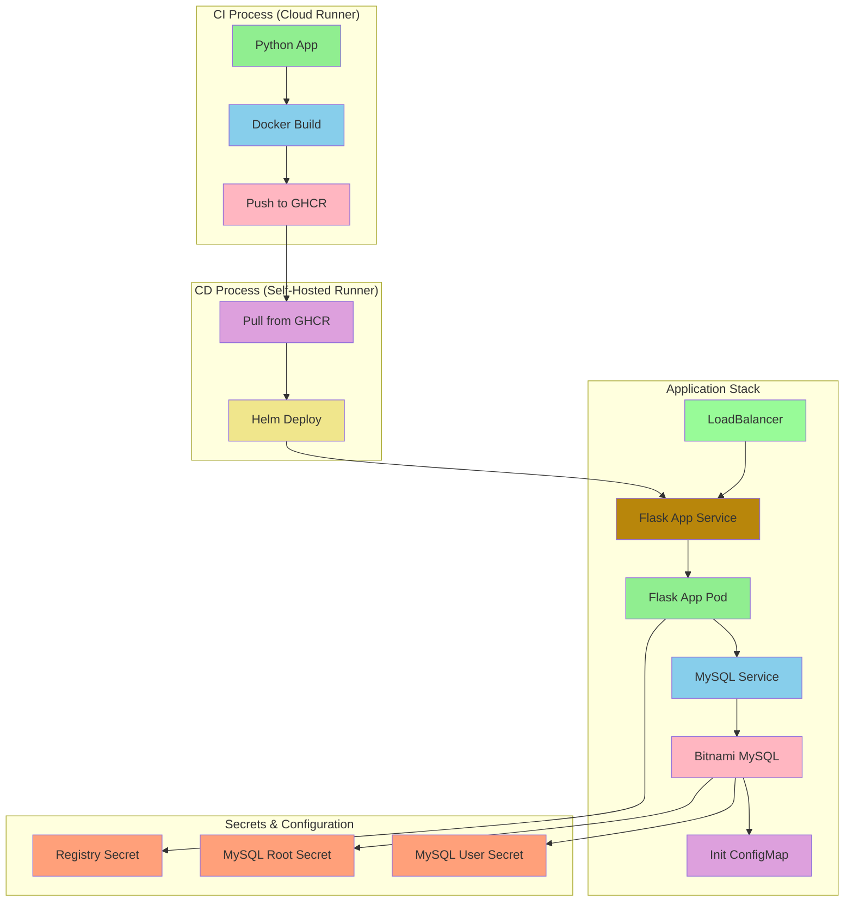
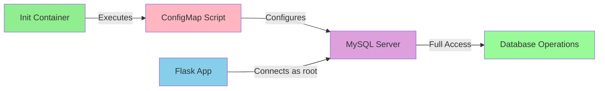

# Overall System Architecture


## Architecture Flow


# MySQL Configuration and User Permissions

## ConfigMap Configuration
```yaml
apiVersion: v1
kind: ConfigMap
metadata:
  name: {{ .Release.Name }}-mysql-init-scripts
data:
  give_root_access.sql: |
    ALTER USER 'root'@'%' IDENTIFIED WITH mysql_native_password BY 'root';
    GRANT ALL PRIVILEGES ON *.* TO 'root'@'%' WITH GRANT OPTION;
    FLUSH PRIVILEGES;
```

### Configuration Breakdown
1. **User Authentication Update**
   ```sql
   ALTER USER 'root'@'%' IDENTIFIED WITH mysql_native_password BY 'root';
   ```
   - Changes authentication method to `mysql_native_password`
   - Enables Flask application compatibility
   - `'%'` allows connections from any host

2. **Privilege Assignment**
   ```sql
   GRANT ALL PRIVILEGES ON *.* TO 'root'@'%' WITH GRANT OPTION;
   ```
   - Grants full access to all databases (`*.*`)
   - `WITH GRANT OPTION` allows user to grant privileges to others
   - Essential for application database operations

3. **Privilege Activation**
   ```sql
   FLUSH PRIVILEGES;
   ```
   - Reloads privilege tables immediately
   - Makes changes take effect without restart

## Integration Flow


## Security Considerations
1. **Development Setup**
   - Root access enabled for easier development
   - Same credentials used in app and database
   - Simplified authentication flow

2. **Production Recommendations**
   - Use restricted user instead of root
   - Implement proper secret management
   - Limit database privileges by function
   - Enable SSL/TLS for connections

## Application Connection
```python
db_config = {
    'host': '<service-name>',
    'user': 'root',          # From secrets
    'password': 'root',      # From secrets
    'database': 'sys'
}
```

## Troubleshooting
```bash
# Verify ConfigMap
kubectl get configmap -n dvir-app <release>-mysql-init-scripts

# Check init script execution
kubectl logs -n dvir-app <mysql-pod> -c init-mysql

# Test connection
kubectl run mysql-client --rm -it --image=mysql:5.7 -- \
  mysql -h <service> -u root -proot -e "SHOW GRANTS;"
```
