# Advanced Cloud-Native CI/CD Pipeline with ArgoCD, Vault, and AWS Integration

## Table of Contents
1. [Project Overview](#project-overview)
2. [Repository Links](#repository-links)
3. [Architecture](#architecture)
4. [Repository Structure](#repository-structure)
5. [Infrastructure Components](#infrastructure-components)
6. [Security Features](#security-features)
7. [Setup Instructions](#setup-instructions)
8. [Troubleshooting Guide](#troubleshooting-guide)

## Project Overview
This project implements a comprehensive cloud-native CI/CD pipeline using GitHub Actions, ArgoCD, HashiCorp Vault, and AWS services. The system features enhanced security through Vault integration for secrets management and AWS KMS for auto-unsealing. The system is split into two repositories for separation of concerns: one for application code (CI) and another for deployment manifests (CD).

## Repository Links
- **CI Repository**: Current repository (Application Code)
- **CD Repository**: [dvir-cd](https://github.com/dvirmoyal/dvir-cd.git) (tag: v2.0.0)
  - Contains Kubernetes manifests and Helm charts
  - Managed by ArgoCD for automated deployment
  - Use `git checkout v2.0.0` for stable release with Vault integration

## Architecture

### Overall System Architecture

```mermaid
graph TB
    subgraph "CI Repository"
        A[Python App] --> B[GitHub Actions]
        B --> C[Build & Test]
        C --> D[Push to GHCR]
        D --> E[Update CD Repo]
        style A fill:#006400
        style B fill:#00008B
        style C fill:#8B0000
        style D fill:#4B0082
        style E fill:#8B4513
    end
    
    subgraph "CD Repository"
        F[Updated Values] --> G[ArgoCD]
        G --> H[Deploy to K8s]
        style F fill:#2F4F4F
        style G fill:#8B4513
        style H fill:#006400
    end
    
    subgraph "AWS Infrastructure"
        I[EC2 with Minikube] --> J[Application Pod]
        K[RDS MySQL] --> J
        L[Vault] --> J
        M[AWS KMS] --> L
        style I fill:#00008B
        style J fill:#8B0000
        style K fill:#4B0082
        style L fill:#2F4F4F
        style M fill:#006400
    end
    
    E --> F
    H --> I
```


### Secrets Management Flow

```mermaid
graph LR
    A[Application Pod] -->|JWT Auth| B[Vault Server]
    B -->|24h Token| A
    C[AWS KMS] -->|Auto-unseal| B
    D[AWS IAM] -->|Authentication| B
    B -->|Secure Storage| E[Encrypted Secrets]
    style A fill:#006400
    style B fill:#00008B
    style C fill:#8B0000
    style D fill:#4B0082
    style E fill:#2F4F4F
```

### Continuous Deployment Flow

### Database Integration Flow

```mermaid
graph LR
    A[Init Container] -->|Executes| B[Vault Auth]
    B -->|Retrieves Secrets| C[MySQL Server]
    D[Flask App] -->|Auth with Token| C
    C -->|Secure Access| E[Database Operations]
    style A fill:#006400
    style B fill:#8B0000
    style C fill:#4B0082
    style D fill:#00008B
    style E fill:#2F4F4F
```


## Repository Structure
```
├── .github/
│   └── workflows/            # GitHub Actions CI workflows
├── app/
│   ├── main.py              # Main application code
│   └── vault_config.py      # Vault integration configuration
├── helm/
│   └── my-chart/my-app-prod         # Helm chart for application deployment
├── k8s/
│   └── app/                # Application manifests
└── README.md
```

## Infrastructure Components

### CI/CD Pipeline Implementation

#### CI Workflow (GitHub Actions)
```yaml
name: PythonApp-CI
on:
  push:
    branches: ["PROD"]
env:
  IMAGE_NAME: dvir-demo
  IMAGE_TAG: v${{ github.run_number }}.0
  REGISTRY: ghcr.io

jobs:
  build:
    runs-on: ubuntu-latest
    permissions:
      contents: read
      packages: write
    steps:
      - uses: actions/checkout@v2
      # [Build steps...]

  update-cd-repo:
    needs: build
    runs-on: ubuntu-latest
    steps:
      - name: Update CD Repository
        run: |
          # Update image tag in CD repository
```

#### CD Configuration (ArgoCD)
```yaml
apiVersion: argoproj.io/v1alpha1
kind: Application
metadata:
  name: dvir-app
  namespace: argocd
spec:
  project: default
  source:
    repoURL: https://github.com/dvirmoyal/dvir-cd.git
    targetRevision: v2.0.0
    path: helm-app-prod/my-chart
  destination:
    server: https://kubernetes.default.svc
    namespace: dvir-app
```

## Security Implementation

### Vault Configuration
```yaml
server:
  ha:
    enabled: true
    raft:
      enabled: true
  dataStorage:
    enabled: true
    size: 10Gi
  extraEnvironmentVars:
    VAULT_ADDR: "http://vault:8200"
    AWS_ACCESS_KEY_ID: "<AWS_ACCESS_KEY_ID>"
    AWS_SECRET_ACCESS_KEY: "<AWS_SECRET_ACCESS_KEY>"
  extraVolumes:
    - type: "secret"
      name: "aws-creds"
      mountPath: "/vault/secrets"
  unsealConfig:
    awsKms:
      enabled: true
      kmsKeyId: "<KMS_KEY_ID>"
      region: "us-east-1"
```

### Application Vault Integration
```python
# Vault configuration for secure secrets management
VAULT_ADDR = getenv("VAULT_ADDR", "http://vault.dvir-app.svc.cluster.local:8200")
VAULT_ROLE = getenv("VAULT_ROLE", "webapp")
JWT_PATH = getenv("JWT_PATH", "/var/run/secrets/kubernetes.io/serviceaccount/token")

def get_vault_client():
    client = hvac.Client(url=VAULT_ADDR)
    with open(JWT_PATH, 'r') as f:
        jwt = f.read()
    client.auth.kubernetes.login(role=VAULT_ROLE, jwt=jwt)
    return client

def get_db_config():
    client = get_vault_client()
    secret_path = 'webapp/config'
    secret = client.secrets.kv.v2.read_secret_version(path=secret_path)
    return {
        'host': getenv("MYSQL_HOST", "my-app-dev-mysql.dvir-app.svc.cluster.local"),
        'user': secret['data']['data']['username'],
        'password': secret['data']['data']['password'],
        'database': 'sys',
        'port': int(getenv("MYSQL_PORT", "3306")),
    }
```

## Enhanced Security Features

1. **HashiCorp Vault Integration**
   - Centralized secrets management
   - Kubernetes authentication using Service Account tokens
   - 24-hour token lifetime for enhanced security
   - Automatic token renewal
   - Secure storage of database credentials and sensitive configurations

2. **AWS KMS Auto-unsealing**
   - Automated Vault unsealing using AWS KMS
   - No manual intervention required for Vault initialization
   - Enhanced security through AWS IAM integration
   - High availability configuration with Raft storage

3. **Security Best Practices**
   - Zero trust architecture with Kubernetes service account authentication
   - Rotation of secrets through Vault's dynamic secrets capability
   - Audit logging of all secret access
   - Principle of least privilege enforced through Vault policies

## Setup Instructions

1. **Clone Repositories**
```bash
# Clone CI Repository
git clone <this-repository>

# Clone CD Repository
git clone https://github.com/dvirmoyal/dvir-cd.git
cd dvir-cd
git checkout v2.0.0
```

2. **Setup Vault**
```bash
# Install Vault Helm Chart
helm repo add hashicorp https://helm.releases.hashicorp.com
helm install vault hashicorp/vault -f vault-values.yaml

# Configure AWS KMS
# Ensure AWS credentials and KMS key are properly configured
```

3. **Configure Application**
```bash
# Create Kubernetes Service Account
kubectl create serviceaccount webapp
kubectl apply -f vault-auth-config.yaml

# Configure Vault Authentication
kubectl exec -it vault-0 -- vault auth enable kubernetes
kubectl exec -it vault-0 -- vault write auth/kubernetes/config \
    kubernetes_host="https://kubernetes.default.svc"
```

4. **Deploy Application**
```bash
# Apply Vault ConfigMap
kubectl apply -f vault-configmap.yaml

# Deploy Application
kubectl apply -f application.yaml
```

5. **Verify Setup**
```bash
# Check Vault Status
kubectl exec -it vault-0 -- vault status

# Verify Application Logs
kubectl logs -f deployment/webapp
```

## Security Considerations   

- Regularly rotate AWS credentials and Vault root tokens
- Monitor Vault audit logs for unauthorized access attempts
- Implement network policies to restrict Vault access
- Use separate Vault paths for different environments
- Implement proper backup procedures for Vault storage

## Troubleshooting Guide

1. **Vault Connection Issues**
   - Verify Vault pod status: `kubectl get pods -n <vault-namespace>`
   - Check Vault logs: `kubectl logs vault-0 -n <vault-namespace>`
   - Ensure service account token exists
   - Verify network connectivity to Vault service

2. **Database Connection Issues**
   - Verify secrets are properly stored in Vault
   - Check application logs for Vault authentication errors
   - Ensure database credentials are correct in Vault
   - Verify database connectivity from application pod

3. **AWS KMS Issues**
   - Check AWS credentials and permissions
   - Verify KMS key accessibility
   - Review Vault server logs for unsealing errors

For detailed documentation about specific components:
- [Vault Configuration Guide](https://www.vaultproject.io/docs)
- [AWS KMS Integration](https://www.vaultproject.io/docs/configuration/seal/awskms)
- [Kubernetes Authentication](https://www.vaultproject.io/docs/auth/kubernetes)