# Advanced Cloud-Native CI/CD Pipeline with ArgoCD and AWS Integration

## Table of Contents
1. [Project Overview](#project-overview)
2. [Repository Links](#repository-links)
3. [Architecture](#architecture)
4. [Repository Structure](#repository-structure)
5. [Infrastructure Components](#infrastructure-components)
6. [Security Features](#security-features)
7. [Setup Instructions](#setup-instructions)
8. [Troubleshooting Guide](#troubleshooting-guide)

## Project Overview
This project implements a comprehensive cloud-native CI/CD pipeline using GitHub Actions, ArgoCD, and AWS services. The system is split into two repositories for separation of concerns: one for application code (CI) and another for deployment manifests (CD).

## Repository Links
- **CI Repository**: Current repository (Application Code)
- **CD Repository**: [dvir-cd](https://github.com/dvirmoyal/dvir-cd.git) (tag: v1.0.0)
  - Contains Kubernetes manifests and Helm charts
  - Managed by ArgoCD for automated deployment
  - Use `git checkout v1.0.0` for stable release

## Architecture

### Overall System Architecture

```mermaid
graph TB
    subgraph "CI Repository"
        A[Python App] --> B[GitHub Actions]
        B --> C[Build & Test]
        C --> D[Push to GHCR]
        D --> E[Update CD Repo]
        style A fill:#006400
        style B fill:#00008B
        style C fill:#8B0000
        style D fill:#4B0082
        style E fill:#8B4513
    end
    
    subgraph "CD Repository"
        F[Updated Values] --> G[ArgoCD]
        G --> H[Deploy to K8s]
        style F fill:#2F4F4F
        style G fill:#8B4513
        style H fill:#006400
    end
    
    subgraph "AWS Infrastructure"
        I[EC2 with Minikube] --> J[Application Pod]
        K[RDS MySQL] --> J
        L[Sealed Secrets] --> J
        style I fill:#00008B
        style J fill:#8B0000
        style K fill:#4B0082
        style L fill:#8B4513
    end
    
    E --> F
    H --> I
```


### Database Integration Flow

```mermaid
graph LR
    A[Init Container] -->|Executes| B[ConfigMap Script]
    B -->|Configures| C[MySQL Server]
    D[Flask App] -->|Connects as root| C
    C -->|Full Access| E[Database Operations]
    style A fill:#006400
    style B fill:#8B0000
    style C fill:#4B0082
    style D fill:#00008B
    style E fill:#2F4F4F
```


[Previous sections remain the same with content through Repository Structure, Infrastructure Components, etc...]

## CI/CD Pipeline Implementation

### CI Workflow (GitHub Actions)
```yaml
name: PythonApp-CI
on:
  push:
    branches: ["PROD"]
env:
  IMAGE_NAME: dvir-demo
  IMAGE_TAG: v${{ github.run_number }}.0
  REGISTRY: ghcr.io

jobs:
  build:
    runs-on: ubuntu-latest
    # [Build job configuration...]

  update-cd-repo:
    needs: build
    runs-on: ubuntu-latest
    # [CD repository update configuration...]
```

### CD Configuration (ArgoCD)
```yaml
# Example ArgoCD Application Configuration
apiVersion: argoproj.io/v1alpha1
kind: Application
metadata:
  name: dvir-app
  namespace: argocd
spec:
  project: default
  source:
    repoURL: https://github.com/dvirmoyal/dvir-cd.git
    targetRevision: v1.0.0
    path: helm-app-prod/my-chart
  destination:
    server: https://kubernetes.default.svc
    namespace: dvir-app
```

[Previous sections remain with Security Features, Setup Instructions, and Troubleshooting Guide...]

## AWS Infrastructure Setup

### EC2 Configuration (User Data Script)
```bash
#!/bin/bash
# Installation of required tools
dnf update -y
dnf install -y docker
# [Additional installation steps...]

# Verification
echo "Installation verification:" > /opt/installation_log.txt
echo "Docker: $(docker --version)" >> /opt/installation_log.txt
# [Additional verification steps...]
```

### RDS Configuration (Terraform)
```hcl
resource "aws_db_instance" "my-app-rds" {
  allocated_storage    = 20
  engine              = "mysql"
  engine_version      = "8.0"
  instance_class      = "db.t3.micro"
  storage_encrypted   = true
  # [Additional configurations...]
}
```

## Security Implementation

### Sealed Secrets Example
```yaml
spec:
  encryptedData:
    password: AgACW//vHLdo3gZv0gcw...
  template:
    metadata:
      name: mysql-root-password-prod
      namespace: dvir-app
```

## Quick Start Guide

1. **Clone Repositories**
```bash
# Clone CI Repository
git clone <this-repository>

# Clone CD Repository
git clone https://github.com/dvirmoyal/dvir-cd.git
cd dvir-cd
git checkout v1.0.0
```

2. **Setup Infrastructure**
```bash
# Apply Terraform Configuration
terraform init
terraform apply

# Setup EC2 Instance
# [EC2 setup instructions...]
```

3. **Configure ArgoCD**
```bash
# Install ArgoCD
kubectl create namespace argocd
kubectl apply -n argocd -f https://raw.githubusercontent.com/argoproj/argo-cd/stable/manifests/install.yaml

# Apply Application
kubectl apply -f application.yaml
```

4. **Deploy Application**
```bash
# Initial Setup
kubectl create namespace dvir-app
kubectl apply -f sealed-secrets/

# Verify Deployment
kubectl get pods -n dvir-app
```

## Contributing
[Previous contributing guidelines remain the same...]

---

For detailed documentation about specific components:
- [ArgoCD Configuration Guide](link-to-argocd-docs)
- [AWS Setup Instructions](link-to-aws-docs)
- [Sealed Secrets Documentation](link-to-sealed-secrets-docs)