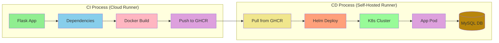

# World of Games - Flask Application

## Project Overview
A Flask-based gaming platform with MySQL database integration, containerized and deployed to Kubernetes using Helm. The application allows users to register, choose games, and track player activities.


## Architecture Flow


## Project Structure
```
project-root/
├── .github/
│   └── workflows/
│       └── ci.yml          # CI/CD pipeline configuration
├── my-chart/              # Helm chart directory
│   ├── Chart.yaml
│   ├── values.yaml
│   └── templates/
│       ├── deployment.yaml
│       ├── service.yaml
│       └── _helpers.tpl
├── app.py                 # Main Flask application
├── live.py               # Game logic and welcome messages
├── MainGame.py           # Game implementation
├── requirements.txt      # Python dependencies
├── Dockerfile           # Container definition
└── README.md
```

## Application Components

### Flask Application
- Web interface for game selection
- Player registration and tracking
- Database integration for player data
- Game difficulty selection
- Multiple game options:
  1. Memory Game
  2. Guess Game
  3. Currency Roulette

### Database Schema
```sql
CREATE TABLE players (
    id INT AUTO_INCREMENT PRIMARY KEY,
    name VARCHAR(255) NOT NULL,
    timestamp TIMESTAMP DEFAULT CURRENT_TIMESTAMP
);
```

## Docker Configuration
```dockerfile
FROM python:3.9-slim
WORKDIR /app
COPY . /app
RUN apt-get update && apt-get install -y \
    default-libmysqlclient-dev \
    build-essential \
    && rm -rf /var/lib/apt/lists/*
RUN pip install --no-cache-dir flask mysql-connector-python
EXPOSE 5000
ENV FLASK_APP=app.py
ENV FLASK_RUN_HOST=0.0.0.0
CMD ["flask", "run"]
```

## Deployment Configuration

### Environment Variables
```yaml
# Required environment variables
MYSQL_HOST: "127.0.0.1"
MYSQL_USER: "root"
MYSQL_PASSWORD: "root"
MYSQL_DATABASE: "sys"
MYSQL_PORT: "3306"
```

### Helm Deployment
```powershell
helm upgrade -i my-app ./ --namespace dvir-app --debug \
  --set image.repository=ghcr.io/dvirmoyal/dvir-demo \
  --set image.tag=$IMAGE_TAG \
  --set replicaCount=2 \
  --set nameOverride=world-of-games
```

## API Endpoints

### Main Routes
- `/`: Welcome page
- `/welcome`: Player registration
- `/game`: Game selection interface
- `/players`: Player history
- `/test_db_connection`: Database connection test

## Local Development
1. Install dependencies:
```bash
pip install flask mysql-connector-python
```

2. Set up MySQL:
```bash
# Ensure MySQL is running locally
mysql -u root -p
# Create required database and user
```

3. Run the application:
```bash
flask run
```

## Deployment Process

### CI Stage (Cloud Runner)
1. Build Python application with dependencies
2. Create Docker image with MySQL client
3. Push to GHCR

### CD Stage (Self-Hosted Runner)
1. Pull latest image
2. Deploy using Helm
3. Verify database connection
4. Confirm application availability

## Monitoring & Troubleshooting

### Application Logs
```bash
# Get pod name
kubectl get pods -n dvir-app

# View logs
kubectl logs <pod-name> -n dvir-app
```

### Database Connection
```bash
# Test database connection
curl http://<service-ip>/test_db_connection
```

## Version History
- v2.0.0: Flask application with MySQL integration
- v1.0.0: Basic Python application

## Next Steps
- Add user authentication
- Implement game statistics
- Add high score system
- Enhance database schema
- Add monitoring and metrics


