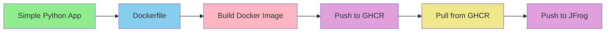

# Basic Python Application with CI Pipeline

## Project Overview
A simple Python application with an automated CI pipeline that builds and pushes Docker images to both GitHub Container Registry (GHCR) and JFrog Artifactory. This represents the first stage of the project, focusing on setting up basic CI/CD infrastructure and container registry integration.

## Architecture Flow



## Project Structure
```
project-root/
├── .github/
│   └── workflows/
│       └── ci.yml          # CI pipeline configuration
├── app.py                  # Python application
├── Dockerfile             # Container definition
└── README.md
```

## CI Pipeline Stages

### 1. Build Job
- **Checkout Code**: Pulls the source code
- **Setup Python**: Configures Python environment
- **Install Dependencies**: Installs required Python packages
- **Setup Docker**: Configures Docker buildx
- **Build & Push to GHCR**: Creates and pushes Docker image
- **Create Release**: Creates a GitHub release

### 2. Use-Image Job
- **Pull from GHCR**: Retrieves the built image
- **Setup JFrog**: Configures JFrog CLI
- **Push to JFrog**: Retags and pushes to JFrog Artifactory

## Required Secrets
- `GITHUB_TOKEN`: For GitHub Container Registry access
- `PAT_GHCR`: Personal Access Token for GitHub
- `JFROG_USER`: JFrog username
- `JFROG_PASSWORD`: JFrog password

## Local Development
### Build and Run
```bash
# Build the image
docker build -t python-app .

# Run the container
docker run python-app
```

## Working with Registries
### GHCR
```bash
# Pull from GHCR
docker pull ghcr.io/dvirmoyal/dvir-demo:<tag>
```

### JFrog Artifactory
```bash
# Pull from JFrog
docker pull dvirmoyal.jfrog.io/dvir-moyal-demo-docker/dvir-demo:<tag>
```

## Troubleshooting
### Common Issues
1. **GitHub Actions Permissions**
   - Ensure proper token permissions
   - Verify repository settings

2. **JFrog Integration**
   - Check JFrog credentials
   - Verify Artifactory URL
   - Ensure proper repository permissions

## Version Tracking
- Each build creates a new release
- Images tagged with both:
  - Commit SHA
  - 'latest' tag

## Next Steps
- Integration with Flask framework
- Database implementation
- Kubernetes deployment
- Security enhancements
