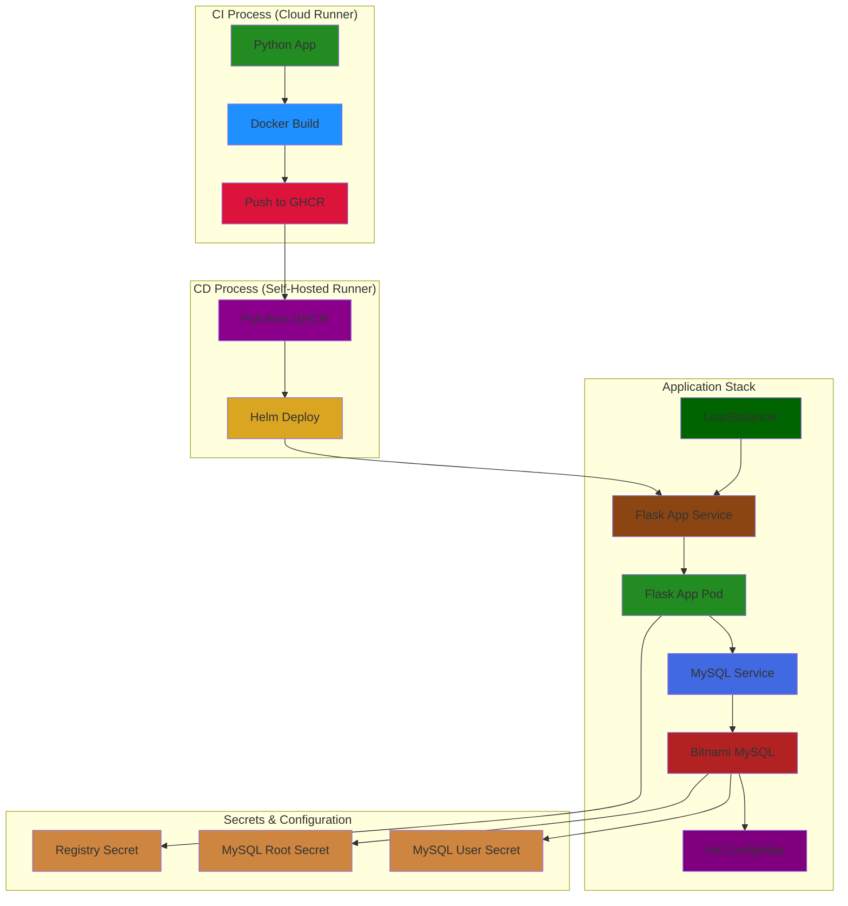
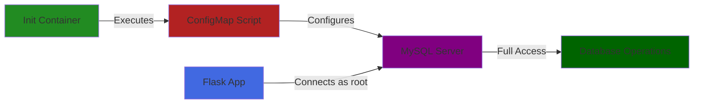

# Python Application with CI/CD Pipeline and Bitnami MySQL Integration

## Table of Contents
1. [Project Overview](#project-overview)
2. [Repository Structure](#repository-structure)
3. [Architecture](#architecture)
4. [Features](#features)
5. [Prerequisites](#prerequisites)
6. [Database Configuration](#database-configuration)
7. [Setup Instructions](#setup-instructions)
8. [Security Considerations](#security-considerations)
9. [Troubleshooting Guide](#troubleshooting-guide)
10. [Contributing](#contributing)

## Project Overview
This project demonstrates a complete CI/CD pipeline implementation using GitHub Actions for CI and a self-hosted runner for CD, deploying a Python Flask application with Bitnami MySQL integration. The pipeline includes automated building, testing, containerization, and deployment processes with secure credentials management and database initialization.

## Repository Structure
```
.
├── .github/
│   └── workflows/          # CI/CD Pipeline definitions
├── my-chart/              # Helm Chart for deployment
│   ├── templates/
│   │   ├── _helpers.tpl
│   │   ├── flask-app-deployment.yaml
│   │   ├── flask-app-service.yaml
│   │   ├── mysql-init-configmap.yaml
│   │   └── secrets-dev.yaml
│   ├── Chart.yaml         # Chart dependencies
│   └── values.yaml        # Default configuration
├── .idea/                 # IDE configuration
├── .cz.toml              # Commitizen configuration
├── .gitignore            # Git ignore rules
├── .pre-commit-config.yaml # Pre-commit hooks
├── Dockerfile            # Application containerization
├── MainGame.py           # Game logic
├── app.py               # Flask application
├── live.py              # Live environment configuration
└── README.md            # Project documentation
```

## Architecture

### Overall System Architecture


## Features
- **Continuous Integration (CI)**
  - Automated builds on the `develop` branch
  - Python environment setup and dependency management
  - Docker image creation and publishing to GitHub Container Registry (GHCR)
  - Automated release creation

- **Continuous Deployment (CD)**
  - Self-hosted runner for deployment control
  - Helm chart deployment with Bitnami MySQL integration
  - Secure credentials management
  - Database initialization and permissions setup

## Prerequisites
- GitHub account with repository access
- Docker installed
- Kubernetes cluster
- Helm 3.x
- Self-hosted runner configured
- Access to GitHub Container Registry

## Database Configuration

### MySQL Initialization
The project uses a ConfigMap to initialize MySQL with proper permissions and authentication settings:

```yaml
apiVersion: v1
kind: ConfigMap
metadata:
  name: {{ .Release.Name }}-mysql-init-scripts
data:
  give_root_access.sql: |
    ALTER USER 'root'@'%' IDENTIFIED WITH mysql_native_password BY 'root';
    GRANT ALL PRIVILEGES ON *.* TO 'root'@'%' WITH GRANT OPTION;
    FLUSH PRIVILEGES;
```

### Database Integration Flow


## Setup Instructions

### 1. Repository Configuration
```bash
# Clone the repository
git clone <repository-url>
cd <repository-name>

# Configure GitHub secrets
# Add the following secrets in your GitHub repository settings:
# - GITHUB_TOKEN
# - PAT_GHCR
```

### 2. Runner Setup
```bash
# Install self-hosted runner
# Follow GitHub's instructions for adding a self-hosted runner
# Ensure the runner has access to your Kubernetes cluster
```

### 3. Database Configuration
```bash
# Create MySQL secrets
kubectl create secret generic mysql-credentials \
  --from-literal=root-password=<root-password> \
  --from-literal=user-password=<user-password> \
  -n dvir-app

# Deploy with Bitnami Chart
helm dependency update ./my-chart
helm upgrade -i my-app-dev ./my-chart \
  --namespace dvir-app \
  --set mysql.auth.rootPassword="${MYSQL_ROOT_PASSWORD}"
```

### 4. Deployment Verification
```bash
# Check deployment status
kubectl get pods,svc -n dvir-app

# Verify MySQL initialization
kubectl logs -n dvir-app <mysql-pod> -c init-mysql

# Test database connection
kubectl run mysql-client --rm -it --image=mysql:5.7 -- \
  mysql -h <service> -u root -p<password> -e "SHOW GRANTS;"
```

## Security Considerations
- Development Environment:
  - Root access enabled for development purposes
  - Simplified authentication flow
  - Shared credentials between app and database

- Production Recommendations:
  - Use restricted database users
  - Implement proper secret rotation
  - Enable SSL/TLS for database connections
  - Limit database privileges based on functionality

## Troubleshooting Guide

### Quick Infrastructure Checks
```bash
# CI Pipeline
- Check GitHub Actions logs
- Verify Docker build locally
- Test GHCR access

# CD Pipeline
- Verify runner status: gh runner list
- Check Helm: helm list -n dvir-app
- Verify Kubernetes: kubectl get all -n dvir-app

# Database
- Check pod status: kubectl get pod -l app=mysql -n dvir-app
- View logs: kubectl logs -f <mysql-pod> -n dvir-app
- Test connection: mysql -h <service> -u root -p<password>

# Application
- Check logs: kubectl logs -f <app-pod> -n dvir-app
- Test DB connection from pod
- Verify environment variables
```

### Common Error Solutions
1. **Pod CrashLoopBackOff**
   - Check logs: `kubectl logs <pod> --previous`
   - Verify resources and configuration

2. **Database Connection Issues**
   - Verify service: `kubectl get svc mysql -n dvir-app`
   - Check credentials and network policies
   - Test connection from application pod

3. **Image Pull Errors**
   - Verify registry secrets
   - Check image name and tag
   - Test manual pull

## Contributing
1. Fork the repository
2. Create your feature branch: `git checkout -b feature/new-feature`
3. Commit your changes: `git commit -am 'feat: add new feature'`
4. Push to the branch: `git push origin feature/new-feature`
5. Submit a pull request

---

For more detailed information about specific components, please refer to the respective documentation in the repository.