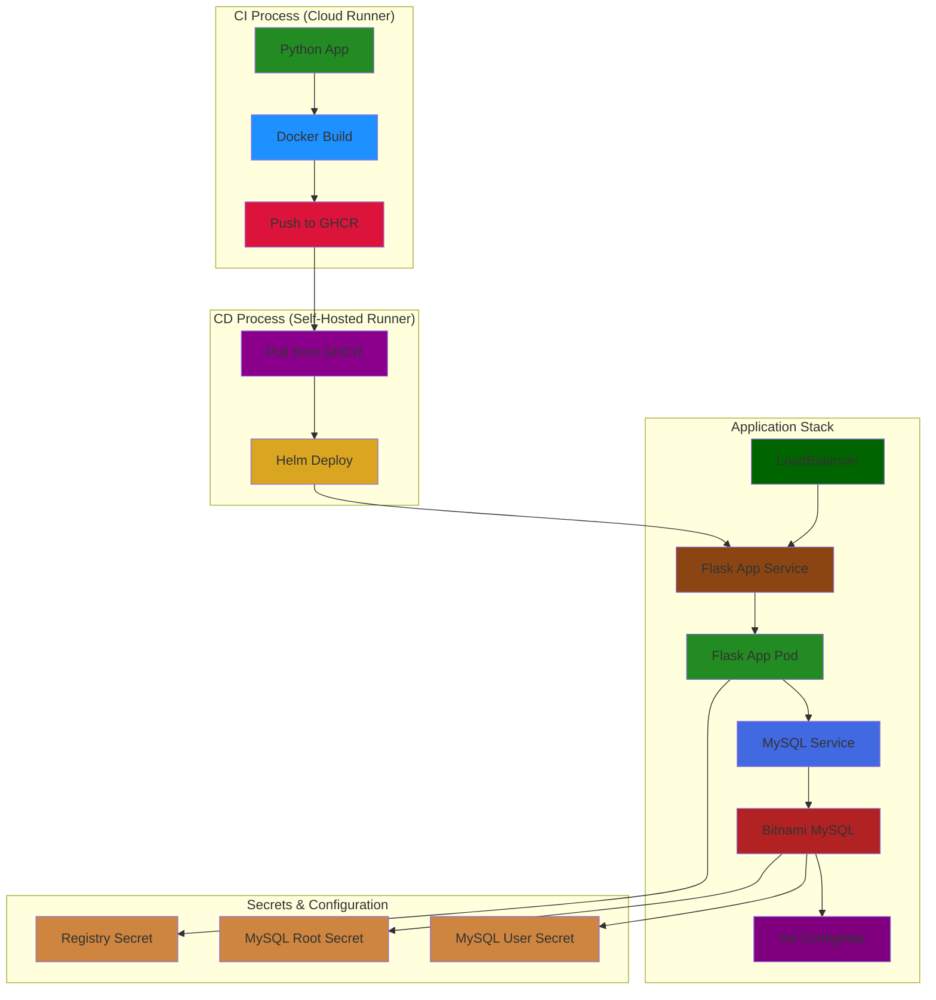
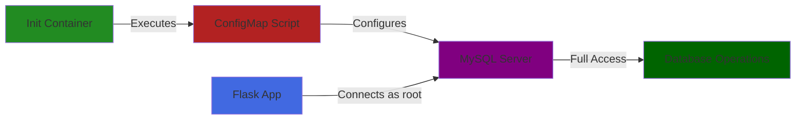

# Python Application with CI/CD Pipeline and Bitnami MySQL Integration

## Table of Contents
1. [Project Overview](#project-overview)
2. [Architecture](#architecture)
3. [Features](#features)
4. [Prerequisites](#prerequisites)
5. [Database Configuration](#database-configuration)
6. [Setup Instructions](#setup-instructions)
7. [Security Considerations](#security-considerations)
8. [Troubleshooting Guide](#troubleshooting-guide)
9. [Contributing](#contributing)

## Project Overview
This project demonstrates a complete CI/CD pipeline implementation using GitHub Actions for CI and a self-hosted runner for CD, deploying a Python Flask application with Bitnami MySQL integration. The pipeline includes automated building, testing, containerization, and deployment processes with secure credentials management and database initialization.

## Architecture

### Overall System Architecture



Key Innovations
Bitnami MySQL Chart Integration
This project leverages the power of Bitnami MySQL Helm Chart, which provides several significant advantages:

Infrastructure as Code Simplification

Eliminates the need for numerous custom Kubernetes YAML files
Replaces 100+ lines of manual configuration with simple Helm values
Automatically handles best practices and common configurations


Built-in Features

Pre-configured MySQL initialization scripts
Automated backup and restore capabilities
Integrated monitoring and health checks
Built-in security best practices


Resource Management
yamlCopy# Instead of multiple YAML files like:
# - mysql-deployment.yaml
# - mysql-service.yaml
# - mysql-configmap.yaml
# - mysql-secrets.yaml
# - mysql-pvc.yaml

# We simply use values.yaml:
mysql:
  auth:
    rootPassword: "${MYSQL_ROOT_PASSWORD}"
  initdbScripts:
    give_root_access.sql: |
      ALTER USER 'root'@'%' IDENTIFIED WITH mysql_native_password BY 'root';
      GRANT ALL PRIVILEGES ON *.* TO 'root'@'%' WITH GRANT OPTION;
      FLUSH PRIVILEGES;
  primary:
    persistence:
      size: 8Gi
  metrics:
    enabled: true


Comparison with Traditional Setup
Traditional Approach (Without Bitnami Chart)
yamlCopy# Needed files:
- mysql-deployment.yaml (~200 lines)
- mysql-service.yaml (~50 lines)
- mysql-configmap.yaml (~50 lines)
- mysql-secrets.yaml (~30 lines)
- mysql-pvc.yaml (~30 lines)
- mysql-rbac.yaml (~40 lines)
Total: ~400 lines of YAML configuration
Bitnami Chart Approach
yamlCopy# Single values.yaml file:
mysql:
  auth:
    rootPassword: "${MYSQL_ROOT_PASSWORD}"
  initdbScripts:
    give_root_access.sql: |
      ALTER USER 'root'@'%' IDENTIFIED WITH mysql_native_password BY 'root';
      GRANT ALL PRIVILEGES ON *.* TO 'root'@'%' WITH GRANT OPTION;
Total: ~10 lines of configuration
Benefits of Using Bitnami Chart

Reduced Complexity

97% reduction in configuration lines
Simplified maintenance and updates
Standardized deployment structure


Built-in Security Features

Secure default configurations
Automated secret management
Built-in security best practices


Enhanced Maintainability

Version-controlled database configurations
Easy updates and rollbacks
Consistent development and production environments


Additional Features at No Cost

Monitoring integration
Backup and restore capabilities
High availability options
Resource scaling


Helm Dependencies Configuration
yamlCopy# Chart.yaml
dependencies:
  - name: mysql
    version: "9.x.x"
    repository: "https://charts.bitnami.com/bitnami"
    condition: mysql.enabled
[Rest of the previous content remains the same...]
Working with Bitnami MySQL Chart
Common Operations

Update Dependencies

bashCopyhelm dependency update ./my-chart

View Chart Configuration

bashCopyhelm show values bitnami/mysql

Custom Configuration

bashCopyhelm upgrade -i my-app-dev ./ --namespace dvir-app \
  --set mysql.auth.rootPassword="${MYSQL_ROOT_PASSWORD}" \
  --set mysql.initdbScripts."give_root_access\.sql"="ALTER USER 'root'@'%' IDENTIFIED WITH mysql_native_password BY 'root';"

Monitoring Chart Status

bashCopyhelm list -n dvir-app
helm status my-app-dev -n dvir-app
Bitnami Chart Troubleshooting
bashCopy# View Chart Dependencies
helm dependency list ./my-chart

# Verify Chart Values
helm get values my-app-dev -n dvir-app

# Check Bitnami MySQL Specific Logs
kubectl logs -f -l app.kubernetes.io/name=mysql -n dvir-app

# View Bitnami MySQL Configuration
kubectl exec -it <mysql-pod-name> -n dvir-app -- \
  cat /opt/bitnami/mysql/conf/my.cnf


## Features
- **Continuous Integration (CI)**
  - Automated builds on the `develop` branch
  - Python environment setup and dependency management
  - Docker image creation and publishing to GitHub Container Registry (GHCR)
  - Automated release creation

- **Continuous Deployment (CD)**
  - Self-hosted runner for deployment control
  - Helm chart deployment with Bitnami MySQL integration
  - Secure credentials management
  - Database initialization and permissions setup

## Prerequisites
- GitHub account with repository access
- Docker installed
- Kubernetes cluster
- Helm 3.x
- Self-hosted runner configured
- Access to GitHub Container Registry

## Database Configuration

### MySQL Initialization
The project uses a ConfigMap to initialize MySQL with proper permissions and authentication settings:

```yaml
apiVersion: v1
kind: ConfigMap
metadata:
  name: {{ .Release.Name }}-mysql-init-scripts
data:
  give_root_access.sql: |
    ALTER USER 'root'@'%' IDENTIFIED WITH mysql_native_password BY 'root';
    GRANT ALL PRIVILEGES ON *.* TO 'root'@'%' WITH GRANT OPTION;
    FLUSH PRIVILEGES;
```

#### Configuration Breakdown
1. **User Authentication Setup**
   - Changes authentication method to `mysql_native_password`
   - Enables Flask application compatibility
   - Allows connections from any host

2. **Privilege Configuration**
   - Grants full access to all databases
   - Enables privilege delegation
   - Implements immediate privilege activation

### Database Integration Flow


## Setup Instructions

### 1. Repository Configuration
```bash
# Clone the repository
git clone <repository-url>
cd <repository-name>

# Configure GitHub secrets
# Add the following secrets in your GitHub repository settings:
# - GITHUB_TOKEN
# - PAT_GHCR
```

### 2. Runner Setup
```bash
# Install self-hosted runner
# Follow GitHub's instructions for adding a self-hosted runner
# Ensure the runner has access to your Kubernetes cluster
```

### 3. Database Configuration
```bash
# Create MySQL secrets
kubectl create secret generic mysql-credentials \
  --from-literal=root-password=<root-password> \
  --from-literal=user-password=<user-password> \
  -n dvir-app

# Apply ConfigMap
kubectl apply -f mysql-init-configmap.yaml -n dvir-app
```

### 4. Deployment Verification
```bash
# Check deployment status
kubectl get pods -n dvir-app
kubectl get services -n dvir-app

# Verify MySQL initialization
kubectl logs -n dvir-app <mysql-pod> -c init-mysql

# Test database connection
kubectl run mysql-client --rm -it --image=mysql:5.7 -- \
  mysql -h <service> -u root -p<password> -e "SHOW GRANTS;"
```

## Security Considerations
- Development Environment:
  - Root access enabled for development purposes
  - Simplified authentication flow
  - Shared credentials between app and database

- Production Recommendations:
  - Use restricted database users
  - Implement proper secret rotation
  - Enable SSL/TLS for database connections
  - Limit database privileges based on functionality

## Troubleshooting Guide

### 1. CI Pipeline Issues
```bash
# Check GitHub Actions logs
- Navigate to Actions tab in GitHub repository
- Review workflow run logs

# Verify Docker Build
docker build -t test-image .
docker run -it test-image

# Test GitHub Container Registry Access
docker login ghcr.io -u $GITHUB_ACTOR -p $GITHUB_TOKEN
docker pull ghcr.io/<your-repo>/<image-name>:latest
```

### 2. CD Pipeline Issues
```bash
# Verify Runner Status
gh runner list
gh runner view <runner-name>

# Debug Environment Variables
echo "Current directory:"
pwd
echo "Directory contents:"
ls -R
echo "Helm version:"
helm version
echo "Kubectl version:"
kubectl version --client
echo "Kubeconfig:"
kubectl config view --minify
```

### 3. Kubernetes Deployment Issues
```bash
# Check Namespace Status
kubectl get namespace dvir-app
kubectl describe namespace dvir-app

# View All Resources
kubectl get all -n dvir-app

# Check Pod Status
kubectl get pods -n dvir-app
kubectl describe pod <pod-name> -n dvir-app
kubectl logs -n dvir-app <pod-name> --previous

# Verify Services
kubectl get services -n dvir-app
kubectl describe service <service-name> -n dvir-app

# Check ConfigMaps
kubectl get configmaps -n dvir-app
kubectl describe configmap <configmap-name> -n dvir-app

# Verify Secrets
kubectl get secrets -n dvir-app
kubectl describe secret <secret-name> -n dvir-app
```

### 4. MySQL Database Issues
```bash
# Check MySQL Pod Status
kubectl get pod -l app=mysql -n dvir-app
kubectl describe pod -l app=mysql -n dvir-app

# Verify MySQL Service
kubectl get svc mysql -n dvir-app
kubectl describe svc mysql -n dvir-app

# Check MySQL Logs
kubectl logs -f <mysql-pod-name> -n dvir-app
kubectl logs -f <mysql-pod-name> -c init-mysql -n dvir-app

# Test MySQL Connection
kubectl run mysql-client --rm -it --image=mysql:5.7 -- \
  mysql -h mysql -u root -p<password> -e "SELECT VERSION();"

# Verify MySQL User Permissions
kubectl run mysql-client --rm -it --image=mysql:5.7 -- \
  mysql -h mysql -u root -p<password> -e "SHOW GRANTS;"

# Check MySQL Configuration
kubectl exec -it <mysql-pod-name> -n dvir-app -- \
  mysql -u root -p<password> -e "SHOW VARIABLES;"
```

### 5. Application Connection Issues
```bash
# Test Application Pod Network
kubectl exec -it <app-pod-name> -n dvir-app -- \
  ping mysql-service

# Verify Environment Variables
kubectl exec -it <app-pod-name> -n dvir-app -- \
  env | grep MYSQL

# Check Application Logs
kubectl logs -f <app-pod-name> -n dvir-app

# Test Database Connection from Application Pod
kubectl exec -it <app-pod-name> -n dvir-app -- \
  python -c "import mysql.connector; \
  cnx = mysql.connector.connect(user='root', \
  password='root', host='mysql-service', \
  database='sys'); \
  print('Connection successful')"
```

### 6. Helm Issues
```bash
# List Helm Releases
helm list -n dvir-app

# Check Helm Release Status
helm status <release-name> -n dvir-app

# Verify Helm Values
helm get values <release-name> -n dvir-app

# Debug Helm Template
helm template <release-name> . --debug

# Check Helm Dependencies
helm dependency list
helm dependency update
```

### 7. Common Error Solutions

#### Pod in CrashLoopBackOff
1. Check logs:
```bash
kubectl logs <pod-name> -n dvir-app --previous
```
2. Verify resource limits:
```bash
kubectl describe pod <pod-name> -n dvir-app | grep -A3 Resource
```

#### MySQL Connection Refused
1. Verify service discovery:
```bash
kubectl get endpoints mysql -n dvir-app
```
2. Check network policies:
```bash
kubectl get networkpolicies -n dvir-app
```

#### Image Pull Failed
1. Verify registry credentials:
```bash
kubectl get secret regcred -n dvir-app -o yaml
```
2. Test manual pull:
```bash
docker pull <your-image>:<tag>
```

## Contributing
1. Fork the repository
2. Create your feature branch: `git checkout -b feature/new-feature`
3. Commit your changes: `git commit -am 'Add new feature'`
4. Push to the branch: `git push origin feature/new-feature`
5. Submit a pull request


---

For more detailed information about specific components, please refer to the respective documentation in the repository.


