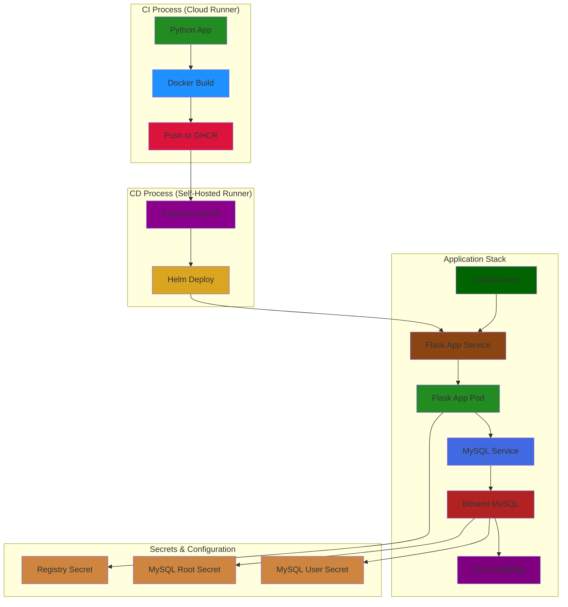
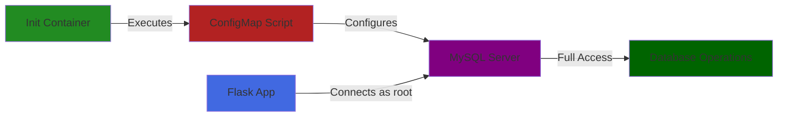

# Python Application with CI/CD Pipeline and Bitnami MySQL Integration

## Table of Contents
1. [Project Overview](#project-overview)
2. [Repository Structure](#repository-structure)
3. [Architecture](#architecture)
4. [Features](#features)
5. [Prerequisites](#prerequisites)
6. [Database Configuration](#database-configuration)
7. [Setup Instructions](#setup-instructions)
8. [Security Considerations](#security-considerations)
9. [Troubleshooting Guide](#troubleshooting-guide)
10. [Contributing](#contributing)

## Project Overview
This project demonstrates a complete CI/CD pipeline implementation using GitHub Actions for CI and a self-hosted runner for CD, deploying a Python Flask application with Bitnami MySQL integration. The pipeline includes automated building, testing, containerization, and deployment processes with secure credentials management and database initialization.

## Repository Structure
```
.
├── .github/
│   └── workflows/          # CI/CD Pipeline definitions
├── my-chart/              # Helm Chart for deployment
│   ├── templates/
│   │   ├── _helpers.tpl
│   │   ├── flask-app-deployment.yaml
│   │   ├── flask-app-service.yaml
│   │   ├── mysql-init-configmap.yaml
│   │   └── secrets-dev.yaml
│   ├── Chart.yaml         # Chart dependencies
│   └── values.yaml        # Default configuration
├── .idea/                 # IDE configuration
├── .cz.toml              # Commitizen configuration
├── .gitignore            # Git ignore rules
├── .pre-commit-config.yaml # Pre-commit hooks
├── Dockerfile            # Application containerization
├── MainGame.py           # Game logic
├── app.py               # Flask application
├── live.py              # Live environment configuration
└── README.md            # Project documentation
```

## Architecture

### Overall System Architecture


[Previous sections about Features, Prerequisites, etc. remain the same...]

## Database Configuration

### MySQL Initialization
```yaml
# mysql-init-configmap.yaml
apiVersion: v1
kind: ConfigMap
metadata:
  name: {{ .Release.Name }}-mysql-init-scripts
data:
  give_root_access.sql: |
    ALTER USER 'root'@'%' IDENTIFIED WITH mysql_native_password BY 'root';
    GRANT ALL PRIVILEGES ON *.* TO 'root'@'%' WITH GRANT OPTION;
    FLUSH PRIVILEGES;
```

### Database Integration Flow


[Rest of the content remains the same...]